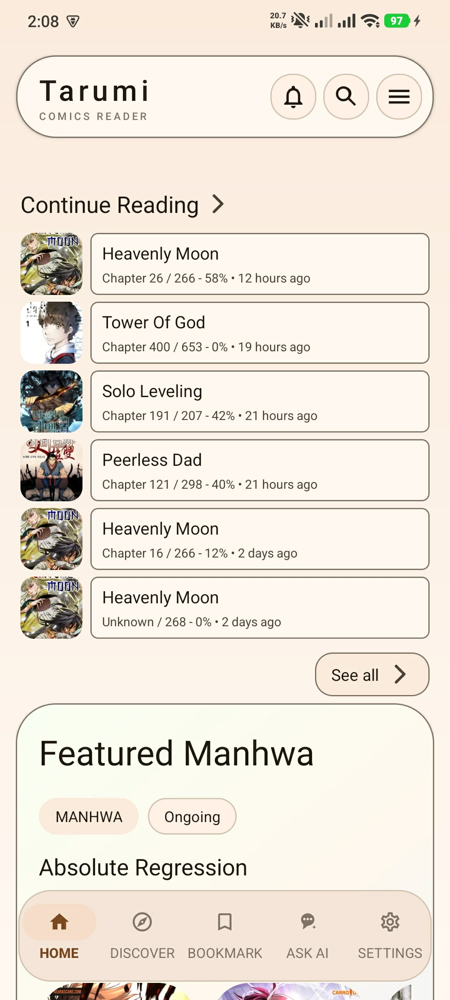
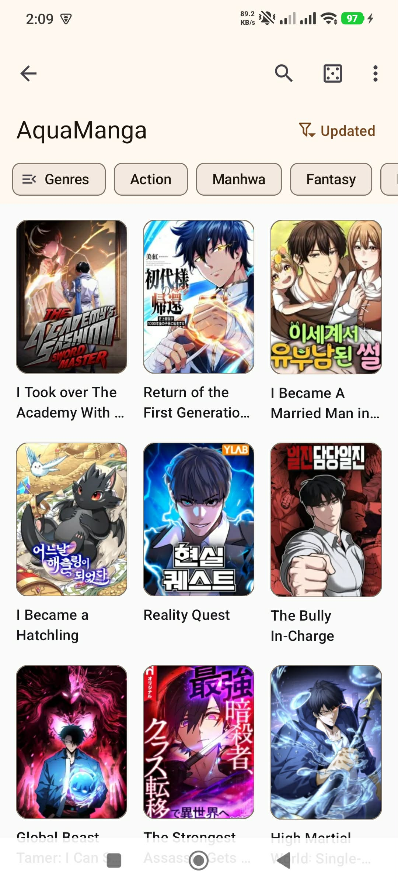
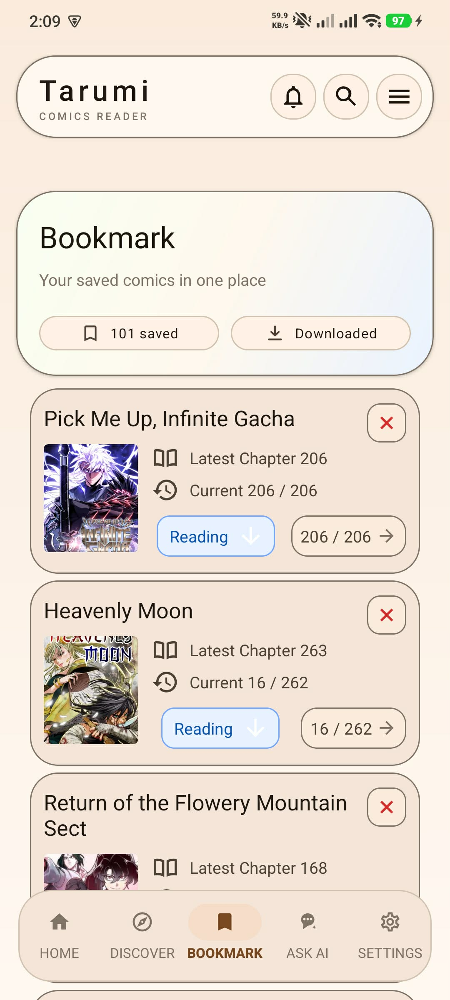
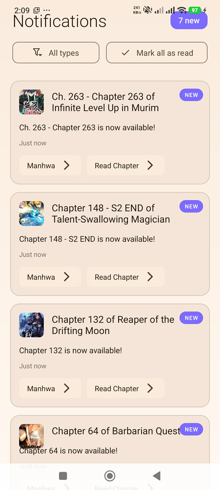
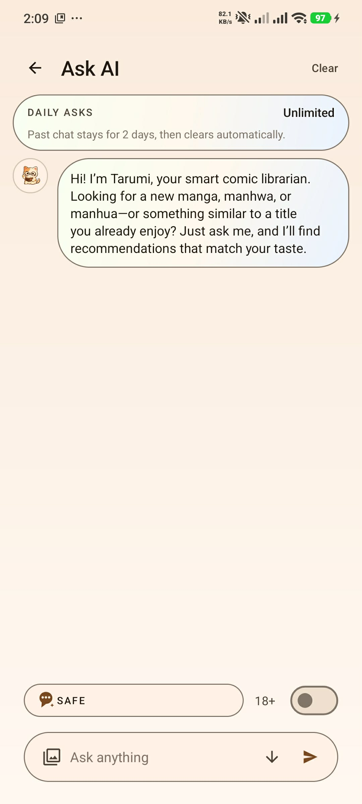
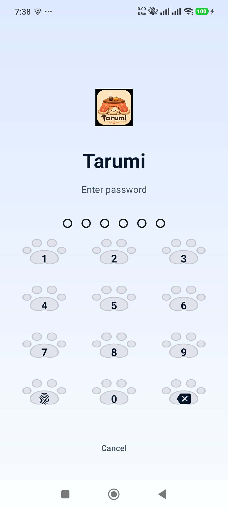

<div align="center">

**[Kotatsu-Redo](https://github.com/Kotatsu-Redo/Kotatsu-Redo) is a free and open-source manga reader for Android with built-in
online content sources. The main goal of the fork is to maintain existing features and sources.**

 [](https://discord.gg/sfPJSQNxfW) [](https://github.com/KotatsuApp/Kotatsu/blob/devel/LICENSE)

### Main Features

<div align="left">

*   **Vast Library and Advanced Discovery**
    *   **1200+ Online Sources**: Access to massive global catalogs for Manga, Manhwa, and Manhua via our parser engine.
    *   **Smart Search & Filtering**: Multi-layered search system filtering by genre, status, update frequency, and source.
    *   **Personalized Recommendations**: Advanced discovery algorithm matching your exact reading preferences.

*   **Premium Material You Interface**
    *   **Gorgeous Dynamic Themes**: Adaptive color palettes including our signature warm **Coffee Theme**, Miku theme, Asuka theme, and customizable Monet dynamic colors.
    *   **Responsive Multi-Device Layout**: Fully optimized fluid UI for phones, foldables, tablets, and desktop configurations.
    *   **Customizable Content Feeds**: Toggle between clean card styles, compact lists, and trending carousels.

*   **Next-Gen Reading Engine**
    *   **Hybrid Reading Modes**: Optimized layout pipelines for standard page-turning and continuous vertical Webtoon formats.
    *   **Offline Access**: Fast downloads with background queueing. Full support for local CBZ / ZIP archives.
    *   **Precision Navigation**: Intuitive page bookmarks, history logging, and immersive full-screen layouts.

*   **AI Librarian Integration ("Ask AI")**
    *   **Smart Chat Assistant**: Talk to **Tarumi**, your personal AI librarian, for direct manga recommendations, series overviews, or to find similar titles.
    *   **Safe Browsing**: Optional 18+ content filters to keep recommendation streams safe and focused.

*   **Privacy and Security First**
    *   **Secure Access**: Password or biometric fingerprint-protected lockscreen featuring a custom cat paw keypad design.
    *   **Incognito Mode**: Pause reading history and recommendations tracking with a single tap.

*   **Sync and Tracking Integrations**
    *   **Cross-Device Progress Sync**: Automatically back up and sync your reading progress, favorites, and settings across all your devices.
    *   **External Tracker Syncing**: Dynamic status and progress integrations with AniList, MyAnimeList, Kitsu, and Shikimori.

</div>

### In-App Screenshots

<div align="center">
    
    
    
    
    
    
</div>

### Contributing

**📌 Pull requests are welcome, if you want:
See [CONTRIBUTING.md](https://github.com/Kotatsu-Redo/Kotatsu-Redo/blob/devel/CONTRIBUTING.md) for the guidelines**

### Certificate fingerprints

```plaintext
70:BD:84:07:13:01:84:5E:A3:D0:A4:E5:F3:3A:D2:41:0D:C9:FC:EB
```

```plaintext
FF:D9:C9:91:06:64:07:69:3C:F4:6E:46:9F:EA:DB:88:8D:33:FB:B2:FB:A7:7E:A3:79:B0:CA:12:A3:5C:66:1A
```

### License

[](http://www.gnu.org/licenses/gpl-3.0.en.html)

<div align="left">

You may copy, distribute and modify the software as long as you track changes/dates in source files. Any modifications
to or software including (via compiler) GPL-licensed code must also be made available under the GPL along with build &
install instructions.

</div>

### DMCA disclaimer

<div align="left">

The developers of this application do not have any affiliation with the content available in the app and does not store
or distribute any content. This application should be considered a web browser, all content that can be found using this
application is freely available on the Internet. All DMCA takedown requests should be sent to the owners of the website
where the content is hosted.

</div>
